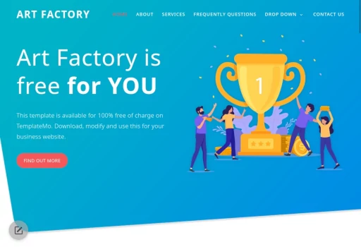

# Simple Landing Page content Editor

**Edit and download your landing page templates for free**

A collection of beautiful, responsive landing page templates that you can edit directly in your browser and download for free.

## Demo

**Live Demo**: [Landing page editor](https://github.com/FranBarInstance/simple-landing-editor/landing)

## 📋 Instructions

When you finish editing your template click on save, you get an index.html file that you must replace with the one you downloaded with the template.

## 🎨 Available Templates

Click on any template image to start editing directly in the editor.

---

### Blaster
[](landing/blaster/index.html)

**[📝 Edit Template](landing/blaster/index.html)**

---

### SEO Dream
[](landing/seo-dream/index.html)

**[📝 Edit Template](landing/seo-dream/index.html)**

---

### Space Dynamic
[](landing/space-dynamic/index.html)

**[📝 Edit Template](landing/space-dynamic/index.html)**

---

### Fox
[](landing/fox/index.html)

**[📝 Edit Template](landing/fox/index.html)**

---

### Landing Page
[](landing/landing-page/index.html)

**[📝 Edit Template](landing/landing-page/index.html)**

---

### New Age
[](landing/new-age/index.html)

**[📝 Edit Template](landing/new-age/index.html)**

---

### Stylish Portfolio
[](landing/stylish-portfolio/index.html)

**[📝 Edit Template](landing/stylish-portfolio/index.html)**

---

### Creative
[](landing/creative/index.html)

**[📝 Edit Template](landing/creative/index.html)**

---

### Digimedia
[](landing/digimedia/index.html)

**[📝 Edit Template](landing/digimedia/index.html)**

---

### Restaurant
[](landing/restaurant/index.html)

**[📝 Edit Template](landing/restaurant/index.html)**

---

### Medic Care
[](landing/medic-care/index.html)

**[📝 Edit Template](landing/medic-care/index.html)**

---

### Grayscale
[](landing/grayscale/index.html)

**[📝 Edit Template](landing/grayscale/index.html)**

---

### Lava Landing
[](landing/lava-landing/index.html)

**[📝 Edit Template](landing/lava-landing/index.html)**

---

### Freelancer
[](landing/freelancer/index.html)

**[📝 Edit Template](landing/freelancer/index.html)**

---

### Coming Soon
[](landing/coming-soon/index.html)

**[📝 Edit Template](landing/coming-soon/index.html)**

---

### Brandi
[](landing/brandi/index.html)

**[📝 Edit Template](landing/brandi/index.html)**

---

### Resume
[](landing/resume/index.html)

**[📝 Edit Template](landing/resume/index.html)**

---

### Casual
[](landing/casual/index.html)

**[📝 Edit Template](landing/casual/index.html)**

---

### Multipurpose
[](landing/multipurpose/index.html)

**[📝 Edit Template](landing/multipurpose/index.html)**

---

### Softy Pinko
[](landing/softy-pinko/index.html)

**[📝 Edit Template](landing/softy-pinko/index.html)**

---

### Newline
[](landing/newline/index.html)

**[📝 Edit Template](landing/newline/index.html)**

---

### Solution
[](landing/solution/index.html)

**[📝 Edit Template](landing/solution/index.html)**

---

### Theme Light
[](landing/themelight/index.html)

**[📝 Edit Template](landing/themelight/index.html)**

---

### First Portfolio
[](landing/first-portfolio/index.html)

**[📝 Edit Template](landing/first-portfolio/index.html)**

---

### One Page Wonder
[](landing/one-page-wonder/index.html)

**[📝 Edit Template](landing/one-page-wonder/index.html)**

---

### Art Factory
[](landing/art-factory/index.html)

**[📝 Edit Template](landing/art-factory/index.html)**

---

### Agency
[](landing/agency/index.html)

**[📝 Edit Template](landing/agency/index.html)**

---

## 🛠️ How to Use

1. **Browse Templates**: Preview the templates by viewing their screenshots above
2. **Edit Template**: Click on any template image or "Edit Template" button to open it in the editor
3. **Customize**: Make your changes using the built-in editor
4. **Download**: Save your customized template to your computer

## 📦 Installation

To get the Simple Landing Page Editor utility:

```bash
git clone https://github.com/FranBarInstance/simple-landing-editor.git
cd simple-landing-editor
```

## 🤝 Contributing

Contributions are welcome! Please feel free to submit a Pull Request.

## 📄 License

This project is open source. Please check the repository for license details.

## 🔗 Links

- **Repository**: [https://github.com/FranBarInstance/simple-landing-editor](https://github.com/FranBarInstance/simple-landing-editor)
- **Editor**: [https://github.com/FranBarInstance/simple-html-editor](https://github.com/FranBarInstance/simple-html-editor)

---

Made with ❤️ by the Simple Landing Page Editor team

## License

MIT License
